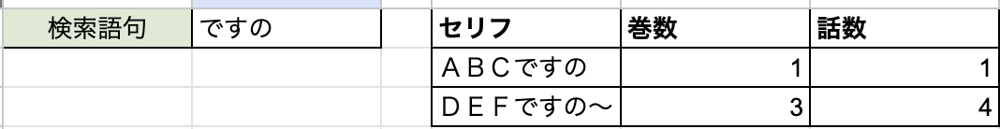

# はじめに

この記事は、私が開発中である Web サイト （Web アプリケーション) である「邪神ちゃんセリフ逆引き辞書(仮)」の作成に際し発生した法的・倫理的問題について詳細な記録を残すことを目的とした記事です。

## 「邪神ちゃんセリフ逆引き辞書(仮)」について
「邪神ちゃんセリフ逆引き辞書(仮)」は漫画作品「邪神ちゃんドロップキック」内で登場するセリフの一部を入力することで、原作の何巻何話に登場したのかを調べることができる Web サイト　(Web アプリケーション) です。

以下は Google スプレッドシートで作成したアプリケーションのサンプルで、入力欄に断片的にセリフを入力することにより、原作何巻何話に登場したセリフなのかを確認することができます。



## 「邪神ちゃんセリフ逆引き辞書(仮)」の抱える権利上の懸念事項について
「邪神ちゃんセリフ逆引き辞書(仮)」は、権利上・倫理上の問題が発生する可能性があります。以下は、今回の問題が顕在化する中で提起された問題の一覧です。

1. 著作権法上の問題が発生しうること
2. 出版社であるフレックスコミックス株式会社のガイドラインに違反すること
3. セリフデータを悪用される可能性があること
4. 「読まれる権利」を侵害すること
5. 「同人活動」という文化を破壊すること
6. 「愛がない」こと

それぞれの項目について、より詳しく見ていきます。

### 著作権法上の問題が発生しうること

「邪神ちゃんセリフ逆引き辞書(仮)」は断片的なセリフから原作何巻何話に登場するセリフなのかを特定するためのツールであり、その検索を行うデータベースとして原作コミックスの「巻数・話数・登場セリフ」をまとめたデータを必要とします。このデータの作成及び公開について、著作権侵害なのではないかという指摘がありました。

この懸念は私が「邪神ちゃんセリフ逆引き辞書(仮)」を考案する段階から認識しておりましたが、以下の事由により、制作及び公開は許容されうるものと考えました。

#### 正当な引用の範疇である可能性
「邪神ちゃんドロップキック」は商業出版物であり、著作権法の適用対象となります。

著作権法には引用 (著作権法 第32条第1項) という項が定められており、その内容は以下の通りです。

```
引用は、公正な慣行に合致するものであり、かつ、報道、批評、研究その他の引用の目的上正当な範囲内で行なわれるものでなければならない。
```

ただし、著作権法による引用は以下の要件を満たす必要があります。「邪神ちゃんセリフ逆引き辞書(仮)」は、以下の事由によりそれを満たすものと考えることができます。

##### 引用部分が明示されている
引用部分はセリフと明確であり、明示されています。

##### 引用元が明示されている
すべてのセリフは何巻何話、という形で常に引用元が明示されています。

##### 主従関係が明確であること
「邪神ちゃんセリフ逆引き辞書(仮)」は主である「邪神ちゃんドロップキック」に対し、明確に従の関係を持ちます。

##### 引用の目的が明確であり、引用の必然性があること
「邪神ちゃんドロップキック」は全22巻(2024-02-02 時点)からなる漫画作品であり、セリフが登場する箇所を調べるには時間と労力が大きくかかります。
「邪神ちゃんセリフ逆引き辞書(仮)」 はその労力を最小化することを目的としており、明確な目的を有しています。

この説明に対する反論として、「時間がかかったとしても原作を読めば良いのだから引用の必然性がない」というものがありましたが、仮にこれが正しいとすると、世の中で行われている多くの引用にも同じことが言えてしまうため、そのような反論は妥当ではないと考えます。

##### 引用部分を改変していないこと
引用対象のセリフについて改変を一切行っていません。改変してしまうと本来の目的を果たせなくなります。

#### 非親告罪の著作権等侵害罪に該当しないと思われること

著作権侵害については、 TPP11 協定に際し一部非親告罪化されています。

しかし、非親告罪として著作権等侵害罪を適用するためには、以下の要件を全て満たす必要があります。

```
２．著作権等侵害罪の一部非親告罪化（新法第123条第２項及び第３項関係）
　海賊版対策の実効性の確保により資する観点から，現在親告罪とされている著作権等侵害罪について，以下の全ての要件に該当する場合に限り，非親告罪の対象とし，著作権者等の告訴がなくとも公訴を提起することができることとしたこと。
　　① 侵害行為の対価として財産上の利益を得る目的又は有償著作物等（権利者が有償で公衆に提供・提示している著作物等）の提供若しくは提示により権利者の得ることが見込まれる利益を害する目的を有していること
　　② 有償著作物等を「原作のまま」公衆譲渡若しくは公衆送信又はこれらのための複製を行うものであること
　　③ 有償著作物等の提供又は提示により権利者の得ることが見込まれる「利益が不当に害されることとなる場合」であること
```

引用元： https://www.hokutopat.com/6277 および[文化庁](https://www.bunka.go.jp/seisaku/bunkashingikai/chosakuken/bunkakai/53/pdf/r1413733_11.pdf)

このうち、「邪神ちゃんセリフ逆引き辞書(仮)」では「権利者の得ることが見込まれる利益を害する目的を有している」の事由から①の構成要件を満たしておらず、非親告罪の著作権等侵害罪には該当しないと考えます。

### 出版社であるフレックスコミックス株式会社のガイドラインに違反すること
「邪神ちゃんドロップキック」は株式会社フレックスコミックスより出版されており、出版元では以下のような著作権ガイドラインが明示されています。

```
画像使用・著作権
　フレックスコミックス株式会社の出版物、および弊社ホームページ上の画像・文章・漫画
　キャラクター等はいずれも著作物であり、著作権法によって権利が守られています。したがいまして、著作権法に定めのある使用方法以外は、権利者の許諾がない限り、インターネットやイントラネット上で以下のような行為をすることは禁じられています。

　　1.出版物の装丁・内容・目次等、の全部または一部を掲載・転載すること。
　　2.ホームページ上の画像・文章・漫画・キャラクター等の全部または一部を掲載・転載すること。
　　3.出版物やホームページ上の文章・漫画等の要約を掲載すること。
　　4.出版物やホームページ上の画像・文章・漫画・キャラクター等をもとに作成した漫画・小説・文章等を掲載すること。
　　5.出版物やホームページ上の画像・漫画・キャラクター等を使用・改変した自作画（イラスト・パロディ等）を掲載すること。
　　6.出版物やホームページ上の画像・漫画・キャラクター等、およびそれらを改変した自作画から、壁紙・アイコン・コンピューターソフト等を作成し、掲載すること。
```

引用元: https://flex-comix.jp/copy-info/

「邪神ちゃんセリフ逆引き辞書(仮)」はこのうち「２」の要件に明確に違反しています。

一方で、「邪神ちゃんドロップキック」における作品展開に際しては、一部権利者が二次創作を推奨していることに留意が必要だと考えます。

- https://jashinchan.com/special
- https://twitter.com/jashinchan_PJ/status/1575868188075921408
- https://twitter.com/Cumene_/status/1739699802269757924
- https://twitter.com/jashinchan_PJ/status/1739702139868606930

また、今回の「邪神ちゃんセリフ逆引き辞書(仮)」に関しても、アニメ公式アカウントより肯定的と取ることもできる反応を頂いています。

- https://twitter.com/jashinchan_PJ/status/1752525106746945885

一方で、出版元であるフレックスコミックス株式会社としてガイドライン違反を許容するかどうかについては確認する必要があると考えており、確認を進めています。

### セリフデータを悪用される可能性があること

作成に反対されている方より、セリフデータを文字列に起こすことによってそれが悪用される懸念があるとの指摘をいただきました。

指摘の内容としては、セリフを文字データとして作成することにより機械翻訳等を駆使して違法な海賊版作品が作成されることを助長するのではないか、という内容でした。

しかし、この指摘については指摘を行った側から Google レンズのような既存のアプリケーションを用いることで既に容易に行えるものなので考慮の必要はないかもしれないと取り下げられました。

### 「読まれる権利」を侵害すること

作成に反対されている方より、便利なツールを作成することで原作を読み返すという作業が行われなくなり、原作の読まれる権利を侵害するのではないかという指摘がありました。

もしこの理屈が成り立つのであれば、本に付箋やしおりを挟むことすらも権利の侵害なのではないかと思います。

### 「愛がない」こと

作成に反対されている方より、あなたのやろうとしている無断転載には我々のような二次創作者と違い愛がないという指摘をいただきました。

愛とは主観的なものでしかなく、作品への愛をあなたの尺度で測られることに正当性はないと考えます。

### 「同人活動」という文化を破壊すること
私の X (旧: Twitter) 上でのポストの通り、同人活動という文化を破壊する可能性があるのかもしれないと考えました。

```
もちろん、その「やめろ」という言葉を無下にするつもりはありません。同人活動というのはすべての人が空気を読んで作品を最大限楽しみ、盛り上げるための手段であり、文化だと思っています。そこに「空気を読めない」行為をすることによって文化を破壊するような行為はしたくないと考えています。
```

引用元: https://twitter.com/zeriyoshi_s/status/1752587398154993741

しかし、これについては現在反対されている方から類似した指摘を一切いただけていないため、単なる私の思い過ごしである可能性が高い状況です。
