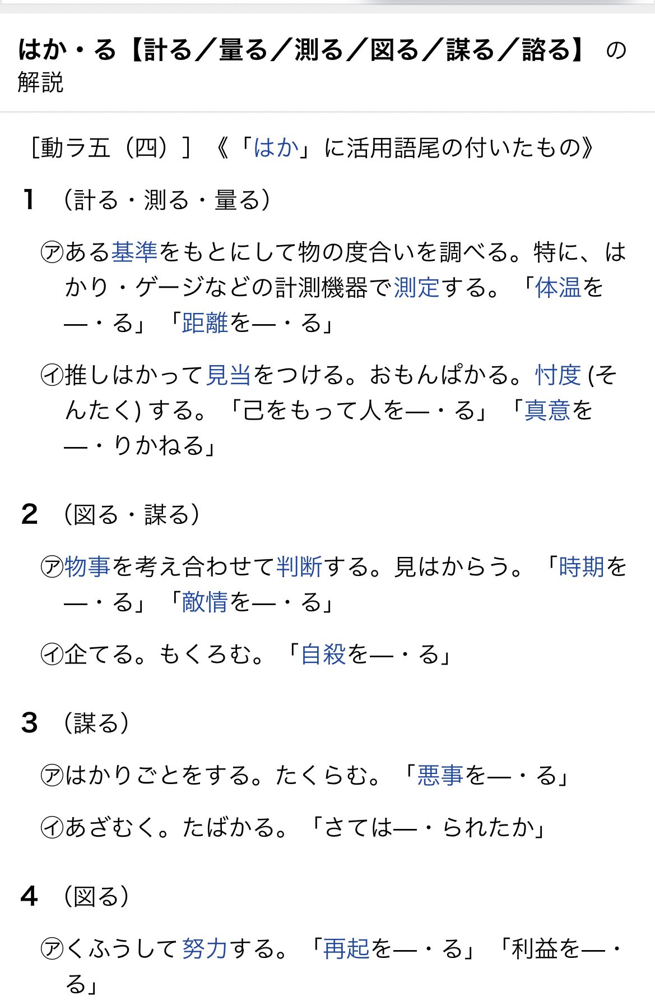

## はじめに

本記事は「邪神ちゃんセリフ逆引き辞書(仮)」で発生した問題について、反対派であるAさんとのX (旧: Twitter) 上でのDMのやりとりを記録したものです。

### 補足事項

- 反対されている方は２人おり、それぞれ `A` さん、 `B` さんとしています。
- 私は一時期 `ぞる` というハンドルネームを用いていたため、Aから `ぞる` と呼ばれている場面がありますが、 `ぜり` と読み替えてください。

### 時系列

1. X上のスペースにて「邪神ちゃんセリフ逆引き辞書(仮)」の話をする
2. スペースに居たAさん、Bさんより否定的な意見を表明される
3. スペース終了
4. 私(ぜり)よりAさんにフォローのDMを送る <- ここ

### 免責事項

このDMによるやり取りを公開することについて相手の許諾を得ていません。しかし以下の事由により、法的問題はないものと考えています。
公開にあたり、弁護士 服部啓一郎さまの note を参考にさせていただいております。

https://note.com/keiichirohattori/n/n6cafef74b1dd

この記事で法解釈について「〜と考えられます」と書いている点については、実際に訴訟を行わない限り答えが出ない (法律とはそういうもの) ためです。

#### 誰であるかを特定できる情報を含まないこと

公開にあたり相手を特定できないよう一部の情報を伏しており、個人の同定可能性を有さないため、名誉毀損 (名誉権の侵害) には該当しません。

#### プライバシー侵害に該当しないこと

個人の同定可能性を有さないため、プライバシーの侵害には該当しません。また仮に個人を特定できたとしても、`「ある事実を公表されない法的利益とこれを公表する理由とを比較衡量し、前者が後者に優越する場合」` を満たさないため、違法性はないものと考えられます。

#### 相手に既にブロックされており、確認手段がないこと

突如ブロックされているため、やり取りを公開する許諾を得ることがそもそも不可能です。

## やり取り本文

ぜり -> Aさん
> 先程はスペースで言い合いのようになってしまって大変申し訳ありませんでしたｍｍ
> 
> 権利侵害かどうかについては権利者側が判断することなので、今回の問題は私のやっていることを倫理的にどう考えるか、という話になるかと思っています。
> 
> 実際、通常の連載漫画でこのような行為を行うことは倫理的に NG であるというのは理解しています。それでも今これを進めているのは、協力いただいている方とスペースで話し合い、邪神ちゃんという漫画のコンテンツとして主の部分は、ストーリーではなく絵や雰囲気にあるであろう、というふうに考え、このシステムを作ることで作品の主の部分を侵害しないであろう、という判断をしたからになります。ただし、最終的にそれが許されるかどうかは権利者側が判断することであり、仮に権利者側から意義が申し立てられた場合すぐに削除するつもりです。
> 
> 一方で、Aさんご自身の道徳観にそぐわない行為をする人間と協力して同人誌を出すことについて懸念があることも理解しています。今回、その部分について話し合わないといけないように思います。
> 
> 例えば AI の使用に懐疑的なイラストレーターの方が AI イラストをやられている方と合同で同人誌を出すかというと、出さないと思います。
> 
> 正直な所、権利的にどうかというより、Aさん・Bさんとしてこのシステムを作る行為についてどう思われますでしょうか。もし少しでも懸念があるようであれば、おそらく画像 bot の技術書のデザインをお願いするのはお互いのためにならないので、やめたほうが良いのではないかと考えています。
> 
> 上記について、お二人で話し合った上で、技術書のデザインをお願いするかどうか、判断いただきたいと考えています。
> 
> まだまだ時間があるので、結論を出すのは１ヶ月後とかでも大丈夫です。心理的負担をおかけして大変申し訳ございませんが、ご判断のほど何卒よろしくお願いいたします🙇

Aさん -> ぜり
> 睡眠薬を飲んじゃったのでお返事はまたするです

Aさん -> ぜり
> まず初めに、わたしは頭が良くありません
> ぞるさんと対等に意見を交換し合えるほどの地力はないと思います
> 
> そちら側が感情ではないかという考え方を書いてしまうと思います
> なぜなら感情があるからです
> 感情と理論を話して意見を言う事はわたしには難しいです
> わたしが頭がよくないからだと思います(そう思います)
> 
> 意見を言った事について言い争ったという気持ちはありません
> 
> フレックスコミック著作規約
> 
> 4.出版物やホームページ上の画像・文章・漫画・キャラクター等をもとに作成した漫画・小説・文章等を掲載すること。
> 5.出版物やホームページ上の画像・漫画・キャラクター等を使用・改変した自作画（イラスト・パロディ等）を掲載すること。
> 
> がありますが、公式側が同人誌イベントを開催したことにより
> 4、5項目を邪神ちゃんドロップキック作品は緩めてくださったのだと思います

Aさん -> ぜり
> 感情的な物の言い方をすれば
> 
> 僕が楽しく遊ぼうとした遊びに文句を言うなら
> もう遊ばない
> 
> と言っているようにも思えます
> 
> そうではない、理論的に技術的にと言い返すでしょうが、
> 水を刺してしまい大変申し訳ない気持ちでいっぱいです

ぜり -> Aさん
> 謝らないでください！何か悪いことをされたという認識ではないですし、むしろとても良い問題定義をしていただけたと思っています

Aさん -> ぜり
> わたし個人は引用について思う事は多々ありますが
> 非常に頭がよくないもので、このような拙い文章を書いてしまいます

ぜり -> Aさん
> 職業柄どうしても堅苦しい文章を書いてしまうのでその点については申し訳ないです。。。ロジハラ的なことがしたいわけではないことはご理解いただけると。。。

> 先程連続でポストしたのですが、今回の件は同人という文化の認識が違うことで起きたすれ違いだと思っています

> 私の認識が間違ってなければ、同人活動は空気を読む文化だと思っています。フレックスコミックスのガイドライン上二次創作全般を禁止しているのに、邪神ちゃんが公式でそういうイベントをやったりしているのもつまりはそういうことなんだと思っています

> そういう世界で、突然空気の読めない行動をする人が現れたら文化がおびやかされてしまいますし、AさんとBさんはそれを危惧されたのだと思っています

Aさん -> ぜり
> 引用について、大学も出ていませんし、論文も書いた事がありませんが
> 大学を出て、論文を書いた事がある方に聞いてみました
> 
> https://halulog.com/blockquote/
> 
> このようなサイトを教えていただき、引用は理由があって引用するという事なのだなと思いました

> そして辞書は意味を調べるためにあると思います
> 
> 辞書で図にあるように「はかる」が何ページにあるか調べる人がいるでしょうか？
> (もしかしたらいるかもしれませんが)

> では、漫画作品のセリフを辞書でひく場合
> どのような引用条件が必要か(？
> と考えました
> (頭がよくないので説明が下手である事を先に謝罪します)
> (これから邪神ちゃんのコミック画像をアップしますが、個人間の説明のためなので、著作権的に見逃してください)

コミック画像の画像なため省略

> 邪神ちゃんドロップキック10巻(ユキヲ/comicメテオ/フレックスコミックス)
> 
> 引用の書き方として本来は画像の下に書くべきdrした

> このページのゆりねのセリフ
> 「それ...見つけちゃったらしょうがないわね」
> を引用するために何が必要なのか
> 
> コミックス9巻の続きであること、何が見つかったのか、本のような物は何か？
> を説明しなければいけないと思います
> (感情ではなくセリフ引用のために必要な事であると考えました)

> 辞書として成立させるなら説明がないと
> 
> 「それ...見つけったったらしょうがないわね」
> 
> 邪神ちゃんドロップキック10巻(ユキヲ/comicメテオ/フレックスコミックス)
> よりセリフ引用
> 
> が成り立たないのではないかと考えました

コミック画像の画像なため省略

> しかし、邪神ちゃん作品の辞書は作る事が可能であると思います

> 画像は
> 
> 邪神ちゃんドロップキック10巻(ユキヲ/comicメテオ/フレックスコミックス)よりコマ抜粋

> このようにゆりねが何度「わははは」と笑ったかとカウントし、発表する事は可能です
> いわゆる用語集になると思います
> 用語集、カウント集には引用の範囲内で引用が可能だと思います
> 引用の範囲内は作者(この場合用語集を編集した人)のアイデア(カウントを数えコメントを加える)量に対し、引用内容は少なくするのが引用の範囲内だと
> (複数人の大学卒の人たちから教えてもらいました)
> 
> (論文は引用のみだと論文ではないという意味合いです)
> 
> 今回は論文ではありませんが。
> 引用の範囲内、引用する理由の薄さ(薄さという表現が感情的に感じられ数値的でないかもしれません)(辞書引きしたいだけなら、漫画を読んで解決できるのでは？)

> そして、頭が悪いなりに思いつく限りの悪いことを考えました
> 
> セリフが全て公開されている
> コピーができるという事
> (コピー禁止でも悪い人はコピーするでしょう)
> 漫画をしらない人(邪神ちゃん)が読んでも意味がわからないか(？)
> キャラ名を検索すれば作品名を知る事ができます
> コピーして多言語に翻訳し、何巻の何コマのセリフか表記してあるならば
> 漫画を写真で撮って日本語を消し多言語海賊版が出来上がります
> そして公開してお金がもうかるかどうかまではよくわからないですが
> この↑海賊版を作るのに使った素材はセリフ辞書だと添えます
> 
> 私はこれが違法であると知っているのでしませんが
> 悪い人はもっと悪い事を考えつくと思います
> 
> 悪い人に悪い事に利用されないような仕組みも必要だなと思いました
> 
> (コミックを写真に撮ってアップロードしている人だっているじゃないかという現場も知っています)
> (誰が悪いという話ではなく、悪い事に利用できるなと思いつきました(しませんが)

> わたしは頭がよくないので、議論の相手にもならないと思います
> このような要領の悪い文章を長く送ってしまった事を謝罪します
> 
> 一生懸命考えたり色んな人に聞いてみて、わたしなりにまとめた内容が以上となり
> 
> 重複になりますが、長い文章で申し訳ありません

ぜり -> Aさん
> いえ、むしろ心労おかけしてしまって申し訳ないですｍｍ

> https://twitter.com/jashinchan_PJ/status/1752525106746945885
> ちなみになのですが、アニメ公式(アニメであって権利者すべてではない)からこのように言われているのですが、Aさん、Bさんとしてはそれでもやめたほうが良いと思われますでしょうか？
> 気を使ったりしなくて良いので、本当に率直なご意見をいただけると嬉しいです

Aさん -> ぜり
> 公式が応援してくれてるのに反対してるのお前たちだけだから今の気持ちどう？ってこと？

> 公式が応援してくれるんだったらいいんじゃないのかな...

ぜり -> Aさん
> ええ...そんな悪意あるように見えますか...

Aさん -> ぜり
> 言い方が難しい...

> 文化？というのがどういう意味合いを指すのかむつかしい...

ぜり -> Aさん
> 単に、同人文化に長い間触れてる人からすると普通こういうことはしないよ、というものなのか聞きたかっただけです

> 同人活動をした経験がないので、感覚がわからなくて

ブロックされたため終了
