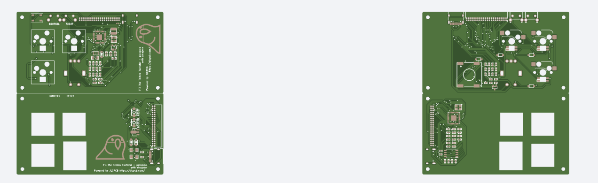

## はじめに

この記事は [JLCPCB](https://jlcpcb.jp) 様にスポンサーいただき執筆しています。
JLCPCB 様から受けたオファーはあくまでもブログ執筆による注文の割引のみであることをここに明記します。

[JLCPCB](https://jlcpcb.jp) 様では新規ユーザー向けのお得なクーポンの配布も行っています。最新のキャンペーン状況については JLCPCB 日本様の [公式 X (旧: Twitter)](https://twitter.com/JLCPCB_Japan) を参照ください！

## きっかけは邪フェス2

このブログを読んでいる人なら自分が [邪神ちゃんドロップキック](https://jashinchan.com) のファンであることはわかっていただけると思うのだけど、そんな邪神ちゃんドロップキック公式の同人イベント (なんだそれ) である邪フェス2が行われることがついこの間告知されました。

前回の邪フェス (ここでは便宜上"邪神フェス1"とする) では NG だったグッズ等の取扱もある程度許容されるとのこと。もともと邪フェス2が実施されるようであれば [邪神ちゃん画像bot](https://zeriyoshi.github.io/OpenJCDK) についての技術本を出そうと思っていましたが、ぶっちゃけ技術本は人を選びすぎるのでもっと万人受けする何かを出したいところ。

そういえば数年前に自作キーボードをやっていたな、ということを思い出し、せっかくなので邪フェス2に向けて邪神ちゃんしっぽ型テンキーを作ってみよう、ということになりました。

## 最近の自作キーボードの潮流を調べる 〜 RP2040 との出会い

キーボード (注: 楽器じゃなくて PC のやつ) 趣味自体はずっと続けていましたが、やはり個人が作れる製品の限界を感じ最近はもっぱら大手メーカーのキットや共同購入等のいわゆるハイエンドキーボードばかりになっており、自分で基板を設計してキーボードを作る、という趣味からは数年くらい離れていました。

大手メーカーや有名設計者が作るハイエンドキーボードに使い心地や品質の面では敵わなくとも、邪神ちゃん関連グッズとしての自作キーボードなら同人ハードウェアとしては唯一無二なものが作れるかもしれません。

ただせっかく作るのであればそこは可能な限り妥協したくありません。ということで最近のトレンドを調べることにしました。

するとどうやら最近は [Sparkfun ProMicro](https://www.sparkfun.com/products/12640) で天下を気づいた Atmel (現: Microchip) `ATMEGA32U4` ではなく、あの有名な [Raspberry Pi Foundation](https://www.raspberrypi.org/) から発売された `RP2040` というチップを使うのが流行っているとのこと。そしてこの RP2040 は ATMEGA32U4 に比べ大幅に高性能で使い勝手も良いということ。

そして何より RP2040 はチップ単位で供給されており、いろいろなものがオープンに公開されているので **自作の基板にそのまま組み込みやすい** ということがわかりました。

当時も ProMicro を利用せず `ATMEGA32U4` を自作の基板に直実装する人は何人か見かけましたが、設計や調達の上でのハードルが高く自分には真似できないなーと思っていたところ。これは憧れの直実装を実現するチャンスです。

というわけで RP2040 を直実装してくれる PCB 屋さんを探すことにしました。

## JLCPCB との出会い

X (旧: Twitter) で電子工作関連について情報収集をしていたところ、どうやら [JLCPCB](https://jlcpcb.jp) という PCB 屋さんであれば `RP2040` を直実装した基板を比較的リーズナブルに作ってくれそうです。

[公式 X (旧: Twitter)](https://twitter.com/JLCPCB_Japan) を見ると、 **新規ユーザー限定で $54 相当のクーポンの配布を行っている** ようでした。また X でフォロー、 DM 送信をすると **更に $10 相当のクーポンが貰えるようです。** 早速フォローして連絡してみました。

するとこのブログを読んだ JLCPCB 担当者様から連絡があり、コラボ記事を書いてくれたら更に注文を割引するよ！とのこと。個人的にも JLCPCB のサービスでどこまでできるのかが見てみたかったのもあり、喜んでオファーを受けることにしました。

RP2040 を直実装したキーボードのサンプル基板を作ってみるぞ！

## KiCad で基板を設計する

JLCPCB で基板を注文するには、まず基板の設計データが必要です。今回はフリーの基板 CAD ソフトである [KiCad](https://www.kicad.org/) を利用して設計を行ってきます。

まずは KiCad をインストールし起動します。 `ファイル` メニューから `新規プロジェクト` をクリックし、適当にプロジェクトを作成してください。

プロジェクト画面が開くので、まずは `回路図エディター` を使って電子回路を組み立てていきます。

回路図の組み立て方を詳細に説明していくとそれだけで本が書けてしまうので省略しますが、私は GitHub で公開されているフリーの RP2040 実装を参考に構築しました。

KiCad の使い方については以下の本がおすすめです。

[KiCad 8 入門実習テキスト　『KiCad Basics for 8.0』](https://booth.pm/ja/items/5554691)

回路図が完成したら、次に `PCB エディター` を使って実際の PCB (プリント基板) をデザインしていきます。

## JLCPCB で PCBA するのに必要な情報を追加する

JLCPCB は基板の製造だけでなく、部品の実装サービス (PCBA: PCB Assembly) も提供しており、今回はこれを利用して `RP2040` とそれを動かす部品を実装した基板を製造してもらいます。

当然ですが PCBA を行うには基板のどこに何の部品を実装するのかを明確に指定してあげる必要があります。

基本的には先程の `回路図エディター` でシンボルのカスタムプロパティを利用して部品番号を指定していくのですが、ぶっちゃけ面倒くさいです。

KiCad には数多くのプラグインがあり、 JLCPCB での製造をサポートするプラグインが用意されているので今回はこれを利用します。

## Bouni KiCAD JLCPCB tools で提出ファイルを作成

[Bouni KiCad JLCPCB tools](https://github.com/Bouni/kicad-jlcpcb-tools) は KiCad を利用して JLCPCB で基板をオーダーする際に便利な機能をまとめた KiCad 用のプラグインで、 GitHub で公開されています。今回はこれをインストールします。

KiCad のメイン画面から `プラグイン＆コンテンツ マネージャー` をクリックします。

次に `管理...` ボタンをクリックし、 Bouni 氏のリポジトリを追加します。

`保存` をクリックするとリポジトリに `Bouni's KiCad repository` が追加されるのでクリックし、 `KiCAD JLCPCB tools` の `インストール` をクリックし、画面右下の `保留中の変更を適用` をクリックします。

するとインストールが行われるので画面を閉じ、 `PCB エディター` に戻ります。画面右上に JLCPCB のアイコンが増えているはずですのでクリックします。

後はこの画面を操作し、 LCSC (JLCPCB と同じ企業が運営している部品商社) で検索した実装したい部品の番号を割り当てていきます。 `RP2040` なら [これ](https://www.lcsc.com/product-detail/Microcontroller-Units-MCUs-MPUs-SOCs_Raspberry-Pi-RP2040_C2040.html) で、番号は `C2040` になります。

実装してほしい全ての部品の割り当てが完了したら左上の `Generate` ボタンを押します。するとプロジェクトのあるディレクトリに `jlcpcb` というディレクトリが作成され、そこの `production_files` ディレクトリに JLCPCB に提出すべきデータが全て生成されています。

## JLCPCB にオーダーする (PCB)

上記のファイルを JLCPCB に提出し、製造してもらいます。

まずは [JLCPCB 公式サイト](https://jlcpcb.jp) を開き、右上の `サインイン` から新規登録します。 Google アカウントを利用してログインできるので非常に楽です。

サインインしたら画面右上の `発注する` をクリックします。すると次のような画面が開きますので、 `ガーバーファイルを追加` をクリックし、先程生成されたファイルの `GERBER-<プロジェクト名>.zip` を選択し、しばらく待ちます。

しばらくすると基板のプレビューが表示されます (すごい！)

次に PCB の基本スペックを選択していきます。それぞれ見ていきますが、基本的に以下の設定で問題ないはずです (そうじゃない人は既に JLCPCB を使っていると思う...)

- ベース素材: FR-4 (よく見る基板です)
- 層: 2 (裏表あるはずなので 2 です)
- 寸法: 多分自動で計算されているはずなので不要
- PCB数量: **要調整** (作る枚数、ほしい枚数設定しましょう)
- 製品タイプ: 産業用/民生用電子機器
- 異なるデザイン: **後述**
- 納品方式: 面付けなし
- PCB厚さ: 1.6 (基板設計による)
- PCBカラー: **好きな色を選んで下さい**
- シルクスクリーン印刷: 白
- 表面仕上: **後述**

### `異なるデザイン` について

自分も勘違いしていたのですが、これは V-cut という基板への切れ込みを入れた場合に数を増やす必要があるようです。

今回の例の場合は V-cut を入れて 1 枚の大きな板から 2 個の基板を切り出すようにしたので、ここは `2` を選ぶ必要があります。当初はこの意味に気付かず `1` のままオーダーしてしまい、ちゃんと `2` にしてね、と担当者の形に怒られてしまいました...

### `表面仕上` について

基板は部品を実装する面にはんだでマスクを行いますが、その表面をどう形成するかを選ぶのがこの選択肢です。

それぞれ以下のような違いがあります。

- HASL: 最も一般的なやつ。ただはんだが載っている。鉛を含むはんだ。最も安い。
- 無鉛HASL: HASL と同じだが、鉛フリーはんだを使用。HASLよりは高いが誤差。
- ENIG: いわゆる金フラッシュというもの。金を使うので高価だがマスクがもっこりせず金色でカッコイイ。

ぶっちゃけ個人で作る基板で HASL だろうと ENIG だろうと影響はほとんど無いと思われるので、好みと予算に応じて選びましょう。ちなみに ENIG にしても PCBA で部品を実装したら金が見えなくなっちゃうはずなので注意。

`高度なオプション` については基本的にそのままで問題ないはずですが、不安であれば `製造用ファイルの事前確認` をはいにしておきましょう。 JLCPCB のエンジニアが製造前に簡単に基板を確認してくれます。

## JLCPCB にオーダーする (PCBA)

今回は PCBA を利用して部品の実装も行ってもらうので、追加で設定を行っていきます。

`PCB組み立て` のところをクリックし、トグルスイッチをオンにします。今回はこんな感じでオーダーしました。

それぞれオプションを見ていきます。

### `PCBAタイプ` って何

JLCPCB の PCBA サービスでは基本的な実装のみを提供する `エコノミー` と実装全般を提供する `標準` の 2 つがあり、それぞれ料金体系が異なります。安いので `エコノミー` が選べるなら選ぶべきですが、以下のような条件が課せられます。

- 両面実装基板はダメ
- 基板の V-cut はダメ
- 黄色基板はダメ
- 0402 以下のサイズの部品はダメ
- その他 JLCPCB 側が Standard 限定としたパーツを使ってはダメ

上の 3 つは割とどうでもいいのですが、最後のやつが結構厄介です。というのも LED 等の光り物はだいたい Standard 限定にされているので、 LED を搭載するだけで Standard 必須になってしまいます。つらい。

今回はそもそも部品を両面実装にして製造するテストなので Standard にしました。

### `組立サイド` って何

上面か下面どちらを PCBA するかを選びます。前述の通り Standard じゃないと片側だけになるのでそれを選びます。

### `PCBA数量` って何

製造する PCB の中から PCBA を行う基板の枚数を指定します。数が分かれているのは基板は 10 枚作りたいけどそのうち PCBA するのは 5 枚だけでいい、みたいな需要に対応するためです。

### `エッジレール/基準` って何

製造に使うエッジレールをどう追加するかを選びます。ここは基本的に任せてしまった方がいいと思うので `JLCPCBに追加される` で良いと思います。どうしても自分で選びたい場合は `お客様に追加される` を選びましょう (どういうパターンならそうしたいのかすらわからないけど)

### `部品配置の確認` って何

製造する前に部品の配置が正しいかを確認します。デフォルトで `いいえ` になってますが、これは `はい` にすることを強くおすすめします。 KiCad の部品配置と JLCPCB 側の部品配置でズレが発生し、パーツの向きが変わってたりするので確認ないと危ないです。私はこれを `はい` にしていたので LED の向きを確認してもらえてとても助かりました。

## JLCPCB にオーダーする (ステンシル)

ステンシルとは自分で PCB への部品実装を行うときに利用する部品の位置に穴が空いた鉄板のことで、これを利用してクリームはんだを塗ったりします。 PCBA をする際には確実に作られるので、欲しいなら有効にしておきます。とはいえ結構高いので自分はオフで注文しました。

## JLCPCB にオーダーする (BOM ・ CPL の提出と位置調整)

上記の設定が終わったら `カートに保存` をクリックして次に進みます。

するとまずは基板のプレビューが表示され、 `次へ` をクリックすることで部品表 (BOM) や部品配置 (CPL) の提出画面が開きます。

それぞれボタンをクリックし、 JLCPCB tools で生成された BOM と CPL ファイルを選択してアップロードしましょう。

アップロードしたら `BOMとCPLを処理する` ボタンを押します。すると部品の対応表や価格、在庫状況が表示されるので、問題ないか確認して更に　`次へ` をクリックします。

私の場合だけかもしれませんがたいてい部品配置がずれてるのでマウスでクリックしてキーボードのカーソルキーで調整します。細かいところは JLCPCB の人が調整してくれるはずですが、あまりにずれてると良くないと思うので調整します。結構操作しにくいのですが、頑張って調整しましょう...

(スクリーンショットを掲載しようと思ったものの JLCPCB サイトが公式が調子悪いのか 3D モデルが表示されなくなっていたので省略)

終わったら `次へ` を押して進みます。高額の注文になる場合は自動で JLCPCB の担当者によるチェックオプションが有効になります。

最後に輸出・輸入の管理用に使われる HS コードを指定する必要があります。今回はキーボードなので `オフィス用品およびアクセサリ` -> `キーボード` を選択しました。

後は通常のショッピングサイトと同じように会計を済ませれば注文は完了です。注文に問題があれば JLCPCB の担当者からメールで連絡が来るので、しっかりメールを確認しておきましょう。

## 注文完了、到着まで待機...

その2に続く...